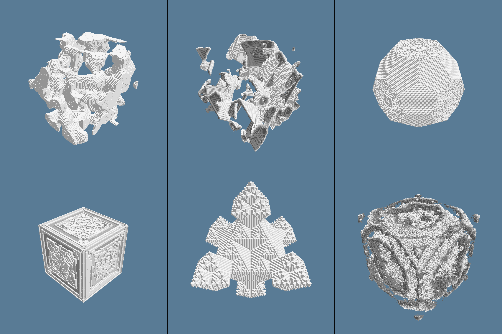

# 3D GOL with wgpu

A 3D Game Of Life capable of simulating arbitrary rules. Rendered with [wgpu](https://wgpu.rs/).



## Run

```sh
cargo run --release
```

For usage information:

```sh
cargo run --release -- --help
```

## Keybinds

| Key    | Effect                   |
| ------ | ------------------------ |
| SPACE  | Unpause/pause simulation |
| RETURN | Step the simulation      |
| R      | Reset to initial state   |
| Q      | Generate new random rule |
| /      | Toggle mouse capture     |

## Rule Format

### Examples

```
0-6/1,3/2/NN
12-26/13-14/2/M
3,5,7,9,11,15,17,19,21,23-24,26/3,6,8-9,11,14-17,19,24/7/M
0b00110011011000101011110111001010/0b00110101010010101101011111010000/2/M
1-4,9-11,13,15-17,19,22-25,27-29,31/4-6,9,12,14,16,18-19,25,28,30/4/M/25/0.5
```

### Grammar

```ebnf
Rule ::= SurviveMask "/" BornMask "/" NumStates "/" Neighborhood [ "/" InitSize]  [ "/" InitDensity ]

SurviveMask   ::= Mask
BornMask      ::= Mask
NumStates      ::= Integer
Neighborhood  ::= "M" | "MN" | "N" | "NN"
InitSize      ::= Integer
InitDensity   ::= Float

Mask     ::= BitMask | ListMask
BitMask  ::= "0b" ( "0" | "1" ) { "0" | "1" }
ListMask ::= [ Integer | Range ] { "," ( Integer | Range ) }

Range   ::= Integer "-" Integer
```

| Neighborhood Code | Neighborhood Kernel        |
| ----------------- | -------------------------- |
| "M"               | Moore & Wrapping           |
| "MN"              | Moore & Non-Wrapping       |
| "N"               | Von Neumann & Wrapping     |
| "NN"              | Von Neumann & Non-Wrapping |

## References

- https://softologyblog.wordpress.com/2019/12/28/3d-cellular-automata-3/